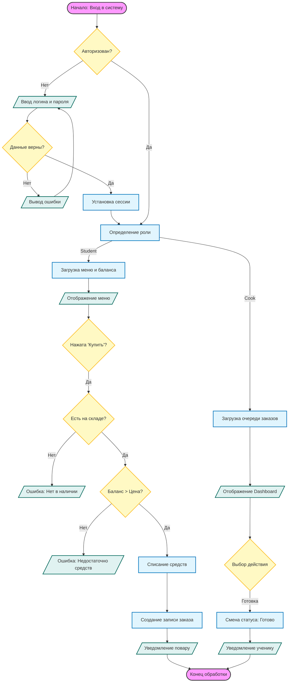

# Smart Столовая

Веб-приложение для автоматизации процессов в школьной столовой. Система объединяет учеников, поваров и администрацию в едином цифровом пространстве.

## 📋 Описание проекта

Проект решает проблему очередей и учета продуктов, предоставляя удобные интерфейсы для разных ролей:

### Роли пользователей:
1.  **Ученик:**
    *   Просмотр актуального меню (завтраки/обеды).
    *   Онлайн-оплата (с баланса или по абонементу).
    *   Система отзывов и рейтингов блюд.
    *   Личный кабинет с настройками.

2.  **Повар:**
    *   **Live-монитор выдачи:** Видит заказы в реальном времени.
    *   **Управление меню:** Создание блюд, публикация меню на день.
    *   **Складской учет:** Отслеживание остатков, автоматические уведомления о дефиците.
    *   **Закупки:** Формирование заявок на продукты (в т.ч. автоматическое).

3.  **Администратор:**
    *   Финансовая аналитика (выручка, графики продаж).
    *   Согласование заявок на закупку продуктов.
    *   Просмотр статистики посещаемости.
    *   Модерация отзывов.

## 🛠 Технологии

*   **Backend:** Python 3, Flask, SQLAlchemy, Flask-Login.
*   **Frontend:** HTML5, CSS3 (Bento Grid, Dark/Light Theme), JavaScript (Fetch API).
*   **Database:** SQLite (для разработки).
*   **Deployment:** Gunicorn (подготовлено для Render/Heroku).

## 🚀 Инструкция по установке и запуску

### Локальный запуск (на компьютере)

1.  **Клонируйте репозиторий:**
    ```bash
    git clone <ссылка-на-ваш-репозиторий>
    cd CanteenProject
    ```

2.  **Установите зависимости:**
    Убедитесь, что у вас установлен Python.
    ```bash
    pip install -r requirements.txt
    ```

3.  **Запустите приложение:**
    ```bash
    python app.py
    ```

4.  **Откройте в браузере:**
    Перейдите по адресу: `http://127.0.0.1:5000`

### Первоначальная настройка
Чтобы создать базу данных и первого администратора, после запуска перейдите по ссылке:
`http://127.0.0.1:5000/reset_db`
*   **Логин:** `admin`
*   **Пароль:** `admin`

### Онлайн-версия (Live Demo)
Ссылка на сайт без установки: https://smartcanteen-sv6h.onrender.com/register
(Зарегистрируйте аккаунт, выбрав роль Ученик, Повар или Администратор).

## 🔄 Алгоритм работы (Блок-схема)

Схема основного процесса обработки заказа (согласно нотации блок-схем):


